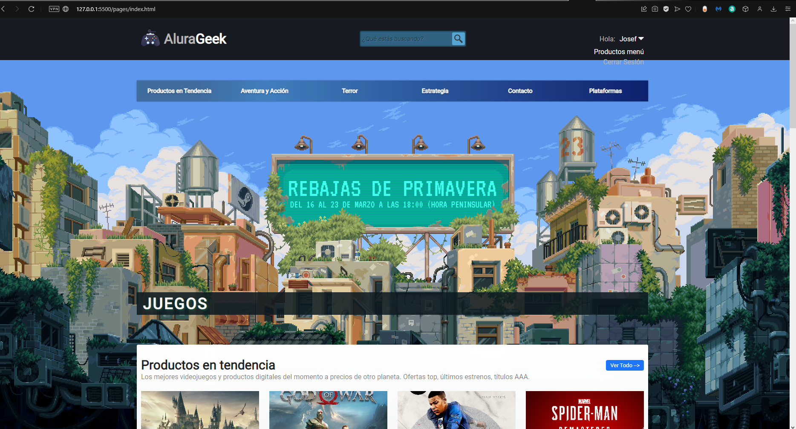
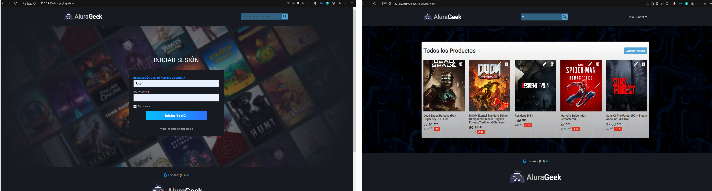

# E-commers


# Demo
[Puedes ver el proyecto aquí 🚀](https://taupe-dodol-54fe4c.netlify.app)

---
## Sección Principal
El menú principal nos muestra un catálogo de productos filtrados por categorías.
## Seccion Usuario
Puedes loguearte al sistema con las credenciales:
Usuario: Josef
Password: alura123
Una vez ingresado al sistema de administración puedes visualizar en la parte del header el nombre del usuario, donde tienes la opción de cerrar sesión y volver al menú principal de todos los productos.
## Buscar Producto
Puedes buscar un producto dentro de la pestaña 'Todo los productos' (por implementar en index o pestaña principal).
## Sección Productos
Una vez ingresado al sistema de administración puedes visualizar todos los productos que se agregaron a la base de datos.
Puedes realizar las siguientes acciones CRUD:
- Visualizar los productos ('GET')
- Agregar producto ('POST')
- Editar producto ('PUT')
- Eliminar productos ('DELETE')
## Sección Agregar y Editar Productos
En esta sección te muestra un formulario con las respectivas validaciones, el cual debes llenar:
- El link de una imagen (subida a la nube).
- La categoría a la que pertenece.
- El nombre del producto.
- El precio inicial (precio sin descuento).
- Descuento que se realizará al precio inicial, equivalente a un porcentaje (%).
- Y una descripción.
---


# Getting Started
Clona este repositorio en tu maquina local usando el comando "git clone".
```
    # Clone the repository
    $ git clone https://github.com/jeinszz01/e-commerce-games.git
    # Move into the repository
    $ cd Ecommerce_Games.git
```

* Instala las dependencias
```
    $ npm install
```

* Inicia el servidor con
```
    $ npm run vite
```

# Stack and tools 🛠️
Las únicas herramientas utilizadas fueron Html, Css, JavaScript y JsonServer.
No se usaron librerías ni packetes.
